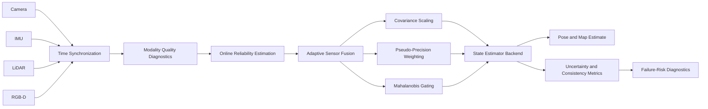

# Adaptive Multi-Modal SLAM with Uncertainty-Aware Sensor Fusion

<p align="center">
  <strong>Reliability-aware state estimation for autonomous robots operating under degraded and heterogeneous sensing.</strong>
</p>

<p align="center">
  <a href="https://github.com/panagiotagrosdouli/Adaptive-Multi-Modal-SLAM-with-Uncertainty-Aware-Sensor-Fusion/actions/workflows/ci.yml"></a>
  
  
  
  
</p>

---

## Research vision

Modern SLAM systems often fuse camera, IMU, LiDAR, and depth measurements using noise assumptions that remain fixed even when sensing quality changes. In real robotic deployments, however, sensors degrade continuously: cameras lose texture, motion blur invalidates visual features, LiDAR returns become sparse, depth measurements saturate, and inertial estimates drift.

This project studies a central question:

> **How can a SLAM system adaptively fuse heterogeneous sensors while explicitly reasoning about uncertainty, reliability, degradation, and failure risk?**

The repository develops a reproducible research framework for adaptive multi-modal fusion. It focuses on interpretable reliability estimation, uncertainty propagation, consistency diagnostics, and failure-aware sensor weighting rather than unsupported state-of-the-art claims.

**Author:** Panagiota Grosdouli  
**Research areas:** probabilistic robotics, visual-inertial odometry, multi-modal SLAM, robust sensor fusion, uncertainty-aware autonomy

---

## Research hypothesis

A state estimator that adjusts the contribution of each sensing modality according to online reliability and innovation consistency should be more robust to sensor degradation than an estimator using fixed covariances or static fusion weights.

The current repository evaluates this hypothesis primarily through deterministic synthetic diagnostics and research scaffolds. Real-world benchmark results remain pending until complete datasets, configurations, metrics, and experiment manifests are committed.

---

## Scientific contributions

| Contribution | Research purpose |
|---|---|
| **Adaptive modality weighting** | Converts online reliability estimates into normalized pseudo-precision weights. |
| **Dynamic covariance inflation** | Reduces the influence of degraded measurements without silently discarding uncertainty. |
| **Innovation-aware gating** | Uses Mahalanobis distance and NIS diagnostics to reject inconsistent updates. |
| **Estimator-consistency analysis** | Supports NEES, NIS, covariance trace, log-determinant, and entropy-style diagnostics. |
| **Failure-aware SLAM diagnostics** | Combines reliability, residual consistency, and uncertainty growth into interpretable risk signals. |
| **Reproducible research pipeline** | Generates metrics, plots, animations, and experiment artifacts from deterministic configurations. |

---

## System architecture



### Runtime reasoning loop

```text
sensor packets
    -> timestamp validation and synchronization
    -> modality-specific quality diagnostics
    -> reliability estimation r_i(k)
    -> covariance adaptation and fusion weighting
    -> innovation consistency checks
    -> state update
    -> uncertainty, trajectory, and failure diagnostics
```

---

## Mathematical formulation

The robot state is represented as

```math
x_k = \{T_{WB,k}, v_{W,k}, b^g_k, b^a_k\},
```

where `T_WB` is the body pose in the world frame, `v_W` is velocity, and `b^g`, `b^a` are gyroscope and accelerometer biases.

For sensing modality `i`,

```math
z^i_k = h_i(x_k, \theta_i) + n^i_k,
\qquad
n^i_k \sim \mathcal{N}(0, \Sigma^i_k).
```

An online reliability estimate `r_i(k) ∈ [0,1]` modifies the measurement contribution:

```math
p_i(k) = \frac{\max(r_i(k),\epsilon)^\gamma}{\sigma_i^2},
\qquad
w_i(k) = \frac{p_i(k)}{\sum_j p_j(k)},
```

and inflates covariance under degradation:

```math
\tilde{\Sigma}_i(k)
=
\frac{\Sigma_i}{\max(r_i(k),\epsilon)^\gamma}.
```

Innovation consistency is evaluated using the normalized innovation squared:

```math
\mathrm{NIS}_i = \nu_i^T S_i^{-1}\nu_i.
```

When ground truth is available, estimator consistency can also be studied using NEES. See [`docs/MATHEMATICAL_FORMULATION.md`](docs/MATHEMATICAL_FORMULATION.md) for the full formulation and assumptions.

---

## Research scope and maturity

This repository is a research prototype, not a production-grade SLAM stack.

| Component | Status | Evidence |
|---|---|---|
| Timestamped sensor abstraction | **Implemented** | `slam_fusion/sensors/base.py`, tests |
| Adaptive pseudo-precision weighting | **Implemented** | `slam_fusion/fusion/adaptive.py`, tests |
| Reliability-based covariance scaling | **Implemented** | `slam_fusion/fusion/adaptive.py` |
| Mahalanobis gating | **Implemented** | fusion module and tests |
| NEES / NIS diagnostics | **Implemented** | `slam_fusion/uncertainty/metrics.py` |
| ATE / RPE evaluation | **Implemented** | `slam_fusion/evaluation/trajectory.py` |
| Visual reliability heuristic | **Implemented baseline** | `slam_fusion/frontend/features.py` |
| Deterministic synthetic experiment | **Implemented** | `run_experiment.py`, configs |
| Demo GIF / MP4 generation | **Implemented** | `scripts/make_demo_gif.py` |
| EKF backend | **Prototype** | backend scaffold |
| Factor-graph backend | **Prototype** | backend scaffold |
| EuRoC / ORB-SLAM3 experiment path | **Prototype** | integration script and config |
| Pose graph and loop closure | **Planned** | no completed benchmark claim |
| LiDAR-only odometry | **Planned** | no completed benchmark claim |
| RGB-D SLAM backend | **Planned** | no completed benchmark claim |
| ROS 2 runtime integration | **Prototype / Planned** | no production node claim |
| Hardware or field validation | **Planned** | future experimental phase |

---

## Installation

```bash
git clone https://github.com/panagiotagrosdouli/Adaptive-Multi-Modal-SLAM-with-Uncertainty-Aware-Sensor-Fusion.git
cd Adaptive-Multi-Modal-SLAM-with-Uncertainty-Aware-Sensor-Fusion

python -m venv .venv
source .venv/bin/activate
python -m pip install --upgrade pip
python -m pip install -e ".[dev]"
```

On Windows:

```powershell
.venv\Scripts\activate
```

Minimal dependency installation:

```bash
python -m pip install -r requirements.txt
```

---

## Quick start

Run the synthetic adaptive-fusion experiment:

```bash
python run_experiment.py --config configs/example_experiment.yaml
```

Run all deterministic research phases:

```bash
python scripts/run_all_phases.py
```

Run the test suite:

```bash
pytest
```

Generate the synthetic demonstration:

```bash
python scripts/make_demo_gif.py \
  --gif assets/demo.gif \
  --mp4 results/videos/demo.mp4 \
  --seed 7
```

The animation visualizes the ground-truth and estimated trajectories, active sensing modalities, adaptive fusion weights, reliability values, uncertainty ellipses, tracking status, and diagnostic risk score.

---

## Experimental protocol

A rigorous evaluation should compare at least the following estimator configurations:

1. visual-only estimation;
2. inertial-only estimation;
3. fixed-weight multi-modal fusion;
4. fixed-covariance fusion;
5. adaptive reliability-aware fusion;
6. oracle reliability, used only as an upper-bound reference.

Recommended degradation conditions include:

| Condition | Example failure mode |
|---|---|
| Nominal sensing | Clean reference experiment |
| Visual blur | Camera motion or defocus |
| Low texture | Feature scarcity |
| Illumination shift | Underexposure or overexposure |
| Camera dropout | Missing visual packets |
| IMU bias drift | Accumulating inertial error |
| Sparse LiDAR | Reduced geometric constraints |
| Depth corruption | Invalid or saturated depth values |
| Timestamp offset | Cross-modal temporal misalignment |

Experiments should use deterministic seeds, versioned configuration files, and machine-readable manifests. Real benchmark values should not be reported unless the corresponding metric files and reproduction instructions are committed.

---

## Evaluation metrics

### Trajectory accuracy

- Absolute Trajectory Error (ATE)
- Relative Pose Error (RPE)
- final translational and rotational drift
- tracking failure rate

### Estimator consistency

- Normalized Innovation Squared (NIS)
- Normalized Estimation Error Squared (NEES)
- covariance trace
- covariance log-determinant
- entropy-style uncertainty proxy

### Reliability and robustness

- modality reliability calibration
- detection delay for degraded sensing
- false sensor-rejection rate
- recovery time following degradation
- failure-prediction lead time

### Computational performance

- runtime frequency / FPS
- processing latency
- CPU and GPU utilization, where instrumented
- memory usage

See [`docs/EVALUATION_PROTOCOL.md`](docs/EVALUATION_PROTOCOL.md) and [`benchmarks/README.md`](benchmarks/README.md).

---

## Dataset and integration targets

### Synthetic diagnostics

The deterministic synthetic experiment is currently the primary executable validation path:

```bash
python run_experiment.py --config configs/example_experiment.yaml
```

### EuRoC MAV

```bash
python run_orbslam3_experiment.py --config configs/orbslam3_euroc.yaml
```

The EuRoC path is experimental. Results remain **Pending** unless complete metric outputs and manifests are committed.

### KITTI Odometry

KITTI support is a planned benchmark target. No KITTI performance claim is made by this repository.

### TUM RGB-D

TUM RGB-D is a planned integration target. Depth association and a complete RGB-D backend are not yet implemented.

### ROS 2

ROS 2 integration is currently a prototype direction. A complete implementation should define camera, IMU, point-cloud, depth, TF, diagnostics, and bag-playback interfaces together with launch files and RViz configurations.

---

## Repository map

```text
configs/                 experiment and integration configurations
slam_fusion/             core SLAM and adaptive-fusion research modules
scripts/                 experiment, evaluation, and visualization tools
tests/                   deterministic unit and smoke tests
docs/                    mathematical, architectural, and evaluation documentation
benchmarks/               benchmark protocol and reporting guidance
assets/                   generated visual research assets
results/                  generated metrics, plots, videos, and manifests
website/                  project website scaffold
run_experiment.py         synthetic experiment entry point
run_orbslam3_experiment.py experimental external-backend path
```

---

## Reproducibility principles

This project follows four reporting rules:

1. **No untraceable benchmark numbers.** Every reported value should map to a config, seed, command, code revision, and output file.
2. **Synthetic evidence is labeled synthetic.** Demonstrations verify software behavior but do not establish field robustness.
3. **Prototype integrations are labeled honestly.** Scaffolds are not described as completed systems.
4. **Uncertainty is evaluated, not merely visualized.** Reliability and covariance estimates should be checked against consistency and trajectory metrics.

---

## Limitations

- The current estimator is not a complete tightly coupled camera–IMU–LiDAR–RGB-D SLAM system.
- EKF and factor-graph components are research scaffolds rather than production backends.
- Real benchmark results on EuRoC, KITTI, TUM RGB-D, TUM-VI, and nuScenes remain pending.
- Diagnostic risk scores are not calibrated probabilities of failure.
- Synthetic demonstrations do not establish real-world robustness.
- Loop closure, relocalization, and long-term mapping are incomplete.
- No dataset is redistributed; users must obtain datasets from their official sources.

---

## Research roadmap

### Phase I — Controlled degradation studies

- complete deterministic camera, IMU, LiDAR, and depth degradation suites;
- compare fixed and adaptive fusion under matched conditions;
- quantify reliability calibration using NIS, NEES, ATE, and RPE.

### Phase II — Real benchmark integration

- add reproducible EuRoC and TUM RGB-D loaders;
- generate dataset manifests and standardized metric reports;
- integrate an established backend such as ORB-SLAM3, OpenVINS, VINS-Fusion, or GTSAM.

### Phase III — Failure-aware autonomy

- predict tracking loss before estimator collapse;
- expose uncertainty and reliability to navigation and planning modules;
- study active perception and uncertainty-aware trajectory selection.

### Phase IV — Robot deployment

- implement ROS 2 nodes, launch files, diagnostics, and rosbag workflows;
- validate on simulated and physical robotic platforms;
- evaluate recovery behavior under controlled sensor failures.

---

## MSc / PhD research directions

- learned reliability estimators with conservative uncertainty calibration;
- adaptive factor weighting in nonlinear optimization;
- multi-modal loop closure under partial sensor dropout;
- uncertainty-aware keyframe and landmark selection;
- active perception driven by estimator observability;
- pre-failure detection and safe navigation responses;
- long-term calibration drift and sensor-health estimation;
- trustworthy fusion of learned and geometric measurements.

A broader research question is:

> **Can a robotic system learn when not to trust its sensors while preserving estimator consistency, interpretability, and operational safety?**

---

## Citation

```bibtex
@software{grosdouli_adaptive_multimodal_slam_2026,
  author  = {Grosdouli, Panagiota},
  title   = {Adaptive Multi-Modal SLAM with Uncertainty-Aware Sensor Fusion},
  year    = {2026},
  url     = {https://github.com/panagiotagrosdouli/Adaptive-Multi-Modal-SLAM-with-Uncertainty-Aware-Sensor-Fusion}
}
```

See `CITATION.cff` for machine-readable citation metadata.

---

## License

This project is released under the MIT License. See [`LICENSE`](LICENSE).

## Acknowledgements

This repository is informed by research in probabilistic robotics, visual-inertial odometry, LiDAR–visual–inertial SLAM, RGB-D SLAM, robust estimation, uncertainty quantification, and safe autonomous navigation. External datasets and backends remain subject to their original licenses and citation requirements.
