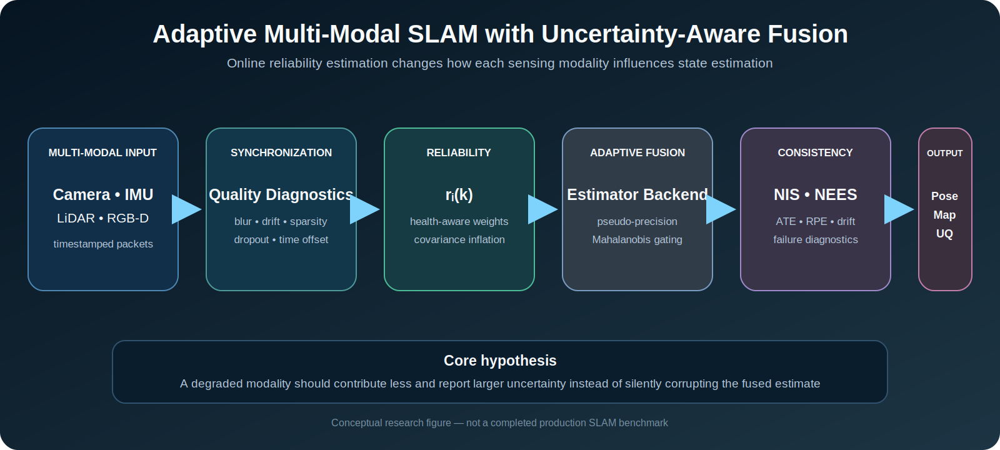

<div align="center">

# Adaptive Multi-Modal SLAM

## Reliability-Aware State Estimation with Uncertainty-Aware Sensor Fusion

A research framework for adapting camera, IMU, LiDAR, and RGB-D contributions when sensing quality changes online.

[](.) [](.) [](.)

**English** · [Ελληνικά](README_GR.md)

</div>

<p align="center"></p>

<p align="center"><em>Conceptual research figure. It is not a completed production SLAM benchmark, a real-dataset result, or a safety guarantee.</em></p>

## Abstract

Multi-modal SLAM systems are commonly designed around fixed noise models and approximately stationary sensor quality. Real robots violate these assumptions: visual texture disappears, images blur, IMU bias drifts, LiDAR geometry becomes weak, depth values saturate, and packet timing degrades. This repository studies a transparent adaptive-fusion baseline in which modality health is estimated online and used to modify fusion weights, measurement covariance, and innovation acceptance.

The current framework provides deterministic synthetic degradation, modality-specific diagnostics, pseudo-precision weighting, covariance inflation, Mahalanobis gating, NIS/NEES utilities, trajectory metrics, and integration scaffolds for broader SLAM backends. Reliability values are treated as engineering diagnostics rather than automatically calibrated probabilities.

## Research question

> How can a SLAM system adapt the contribution of camera, IMU, LiDAR, and RGB-D measurements when their reliability changes online?

## Runtime architecture

```text
sensor packets
  → timestamp validation and synchronization
  → modality-quality diagnostics
  → reliability estimate r_i(k)
  → adaptive covariance and fusion weighting
  → innovation consistency checks
  → estimator update
  → pose, map, uncertainty, and failure diagnostics
```

## Mathematical perspective

For modality `i`, a reliability score defines pseudo-precision and normalized weight:

```math
p_i(k)=\frac{\max(r_i(k),\epsilon)^\gamma}{\sigma_i^2},
\qquad
w_i(k)=\frac{p_i(k)}{\sum_j p_j(k)}.
```

Measurement covariance is inflated under degradation:

```math
\tilde{\Sigma}_i(k)=\frac{\Sigma_i}{\max(r_i(k),\epsilon)^\gamma}.
```

Innovation consistency is monitored using

```math
\mathrm{NIS}_i=\nu_i^TS_i^{-1}\nu_i.
```

When ground truth is available, NEES complements trajectory metrics by testing whether reported uncertainty is statistically consistent.

## Research contributions

- reliability-aware modality weighting;
- dynamic covariance inflation;
- Mahalanobis gating and NIS/NEES diagnostics;
- ATE, RPE, drift, and recovery summaries;
- deterministic visual, inertial, LiDAR, depth, and timing degradations;
- estimator and dataset integration scaffolds.

## Verified scope

| Research layer | Current capability |
|---|---|
| Sensor abstraction | Camera, IMU, LiDAR, and depth interfaces |
| Quality diagnostics | Implemented baselines |
| Adaptive weighting | Implemented and tested |
| Covariance adaptation | Implemented and tested |
| Consistency monitoring | NIS, NEES, Mahalanobis utilities |
| Synthetic experiment | Deterministic validation path |
| EKF and factor graph | Research scaffolds |
| EuRoC / ORB-SLAM3 | Experimental integration path |
| ROS 2 / hardware | Not validated |

## Reproduce

```bash
git clone https://github.com/panagiotagrosdouli/Adaptive-Multi-Modal-SLAM-with-Uncertainty-Aware-Sensor-Fusion.git
cd Adaptive-Multi-Modal-SLAM-with-Uncertainty-Aware-Sensor-Fusion
python -m venv .venv
source .venv/bin/activate
python -m pip install -e ".[dev]"
python run_experiment.py --config configs/example_experiment.yaml
python scripts/run_all_phases.py
pytest
```

## Evaluation protocol

A rigorous comparison should include visual-only, inertial-only, fixed-weight fusion, fixed-covariance fusion, adaptive fusion, and oracle reliability as an upper-bound reference only. Relevant metrics include ATE, RPE, drift, NIS, NEES, covariance summaries, false rejection, detection delay, tracking failure, recovery time, and computation where instrumented.

## Limitations

- The repository is not a complete production camera–IMU–LiDAR–RGB-D SLAM stack.
- EKF and factor-graph components remain research scaffolds.
- Real benchmark execution on EuRoC, KITTI, TUM RGB-D, and TUM-VI remains pending.
- Reliability and risk scores are not automatically calibrated probabilities.
- Loop closure, relocalization, long-term map management, ROS 2, and hardware validation are incomplete.
- No state-of-the-art or formal-safety claim is made.

## Responsible use

Synthetic outputs validate software behavior and reproducibility, not field robustness or safety-critical deployment readiness.
