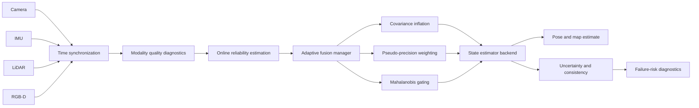

# Adaptive Multi-Modal SLAM

<p align="center">
  <strong>Reliability-aware state estimation for autonomous robots operating under degraded and heterogeneous sensing.</strong>
</p>

<p align="center">
  <a href="https://github.com/panagiotagrosdouli/Adaptive-Multi-Modal-SLAM-with-Uncertainty-Aware-Sensor-Fusion/actions/workflows/ci.yml"></a>
  
  
  
  
</p>

<p align="center">
  
</p>

<p align="center"><em>Generated explanatory visual. It describes the intended reliability-aware fusion logic and is not a real-dataset benchmark result.</em></p>

> **Research question**  
> How can a SLAM system adapt the contribution of camera, IMU, LiDAR, and RGB-D measurements when their reliability changes online?

---

## Why adaptive fusion?

Conventional sensor-fusion pipelines often assume that measurement noise remains approximately fixed. Real robotic systems violate that assumption continuously:

- cameras lose texture or suffer motion blur;
- IMU estimates accumulate bias and drift;
- LiDAR returns become sparse or geometrically weak;
- depth measurements saturate or disappear;
- timestamps become misaligned;
- one sensing modality may fail while others remain useful.

Adaptive Multi-Modal SLAM treats modality health as a first-class state-estimation signal. The framework estimates sensor reliability, modifies covariance and fusion weights, checks innovation consistency, and records uncertainty and failure diagnostics without presenting heuristic scores as calibrated probabilities.

This repository is a **research prototype**, not a production SLAM stack or certified safety system.

---

## At a glance

| Research layer | Current capability | Evidence level |
|---|---|---|
| Sensor abstraction | Timestamped camera, IMU, LiDAR and depth interfaces | Implemented / tested |
| Modality diagnostics | Visual and modality-quality baselines | Implemented baseline |
| Adaptive weighting | Reliability-based pseudo-precision weighting | Implemented / tested |
| Covariance adaptation | Reliability-dependent covariance inflation | Implemented / tested |
| Consistency monitoring | Mahalanobis gating, NIS and NEES utilities | Implemented / tested |
| Trajectory evaluation | ATE, RPE and drift summaries | Implemented |
| Synthetic experiment | Deterministic degradation and fusion pipeline | Synthetic validation |
| EKF and factor graph | Backend scaffolds | Prototype |
| EuRoC / ORB-SLAM3 path | Experimental integration scaffold | Pending complete benchmark |
| ROS 2 / hardware | Planned research direction | Not validated |

---

## Fusion architecture



The runtime reasoning loop is:

```text
sensor packets
    → timestamp validation and synchronization
    → modality-specific quality diagnostics
    → reliability estimation r_i(k)
    → covariance adaptation and fusion weighting
    → innovation consistency checks
    → state update
    → trajectory, uncertainty and failure diagnostics
```

---

## Mathematical perspective

The robot state is represented as

```math
x_k = \{T_{WB,k}, v_{W,k}, b^g_k, b^a_k\}.
```

For sensing modality `i`,

```math
z^i_k = h_i(x_k, \theta_i) + n^i_k,
\qquad
n^i_k \sim \mathcal{N}(0, \Sigma^i_k).
```

An online reliability estimate `r_i(k) ∈ [0,1]` defines a pseudo-precision

```math
p_i(k) = \frac{\max(r_i(k),\epsilon)^\gamma}{\sigma_i^2},
\qquad
w_i(k) = \frac{p_i(k)}{\sum_j p_j(k)},
```

and inflates measurement covariance under degradation:

```math
\tilde{\Sigma}_i(k)
=
\frac{\Sigma_i}{\max(r_i(k),\epsilon)^\gamma}.
```

Innovation consistency is evaluated using

```math
\mathrm{NIS}_i = \nu_i^T S_i^{-1}\nu_i.
```

When ground truth is available, NEES complements trajectory accuracy by testing whether reported uncertainty is statistically consistent. See [`docs/MATHEMATICAL_FORMULATION.md`](docs/MATHEMATICAL_FORMULATION.md).

---

## Core research contributions

### Reliability-aware modality weighting

Each modality contributes according to online health rather than a fixed global weight. The current implementation provides a transparent and dependency-light baseline suitable for controlled comparison.

### Dynamic covariance inflation

A degraded sensor is not silently ignored. Its uncertainty is increased explicitly, reducing its influence while preserving the estimator's uncertainty semantics.

### Innovation-aware gating

Mahalanobis distance and normalized innovation statistics identify measurements that are inconsistent with the predicted belief state.

### Estimator introspection

The evaluation layer supports:

- NIS and NEES;
- covariance trace and log-determinant;
- entropy-style uncertainty summaries;
- ATE and RPE;
- tracking-failure and recovery diagnostics;
- modality reliability traces.

### Reproducible synthetic degradation

The executable synthetic path supports controlled visual, inertial and cross-modal degradation studies with deterministic configuration and generated artifacts.

---

## Installation

```bash
git clone https://github.com/panagiotagrosdouli/Adaptive-Multi-Modal-SLAM-with-Uncertainty-Aware-Sensor-Fusion.git
cd Adaptive-Multi-Modal-SLAM-with-Uncertainty-Aware-Sensor-Fusion

python -m venv .venv
source .venv/bin/activate
python -m pip install --upgrade pip
python -m pip install -e ".[dev]"
```

Windows PowerShell:

```powershell
.venv\Scripts\activate
python -m pip install -e ".[dev]"
```

---

## Reproduce the current evidence

Run the deterministic adaptive-fusion experiment:

```bash
python run_experiment.py --config configs/example_experiment.yaml
```

Run all research phases:

```bash
python scripts/run_all_phases.py
```

Run tests:

```bash
pytest
```

Generate the synthetic demonstration:

```bash
python scripts/make_demo_gif.py \
  --gif assets/demo.gif \
  --mp4 results/videos/demo.mp4 \
  --seed 7
```

The resulting animation can display ground truth and estimated trajectories, active modalities, adaptive fusion weights, reliability values, uncertainty ellipses, tracking status, and diagnostic risk scores.

---

## Experimental protocol

A rigorous comparison should include:

1. visual-only estimation;
2. inertial-only estimation;
3. fixed-weight multi-modal fusion;
4. fixed-covariance fusion;
5. adaptive reliability-aware fusion;
6. oracle reliability as an upper-bound reference only.

Recommended degradation conditions include visual blur, low texture, illumination shift, camera dropout, IMU bias drift, sparse LiDAR, depth corruption and timestamp offset.

Every experiment should record its configuration, seed, software revision, dataset or scenario, estimator backend and output artifacts.

---

## Evaluation dimensions

| Dimension | Metrics |
|---|---|
| Trajectory accuracy | ATE, RPE, translational and rotational drift |
| Estimator consistency | NIS, NEES, covariance trace, log-determinant |
| Reliability | calibration trend, false rejection, detection delay |
| Robustness | tracking failure, recovery time, degradation sensitivity |
| Computation | frequency, latency, CPU/GPU and memory where instrumented |

Synthetic outputs validate software behavior; they do not establish real-world robustness or state-of-the-art performance.

---

## Dataset and integration targets

### Synthetic diagnostics

This is the primary executable validation path today.

### EuRoC MAV / ORB-SLAM3

```bash
python run_orbslam3_experiment.py --config configs/orbslam3_euroc.yaml
```

This path is experimental. A benchmark result is considered complete only when the associated configuration, metric files and manifest are committed.

### KITTI and TUM RGB-D

These remain planned benchmark targets. No performance claim is made for them in this README.

### ROS 2

ROS 2 integration remains prototype/planned work. A complete implementation would require synchronized camera, IMU, point-cloud and depth interfaces, TF publication, diagnostics, launch files, bag replay and runtime evaluation.

---

## Repository map

```text
configs/          experiment and integration configurations
slam_fusion/      core SLAM and adaptive-fusion research modules
scripts/          experiment, evaluation and visualization tools
tests/            deterministic unit and smoke tests
docs/             mathematical, architectural and evaluation documentation
benchmarks/        benchmark protocol and reporting guidance
assets/           generated visual research assets
results/          generated metrics, plots, videos and manifests
website/          project website scaffold
```

---

## Research roadmap

```text
controlled synthetic degradation
    → identical-seed fusion baselines
    → reliability calibration studies
    → EuRoC execution and manifests
    → additional LiDAR / RGB-D datasets
    → ROS 2 bag replay and simulation
    → field experiments
```

Near-term priorities are completing an executable tightly coupled estimator sequence, strengthening modality calibration, adding ablation studies and validating the experimental dataset paths without fabricating unavailable uncertainty labels.

---

## Limitations

- The estimator is not yet a complete production camera–IMU–LiDAR–RGB-D SLAM system.
- EKF and factor-graph components remain research scaffolds.
- Real benchmark results on EuRoC, KITTI, TUM RGB-D and TUM-VI remain pending.
- Reliability and risk scores are not automatically calibrated probabilities.
- Loop closure, relocalization and long-term map management are incomplete.
- ROS 2, simulation and physical-robot validation are not currently claimed.
- No formal safety guarantee or state-of-the-art claim is made.

---

## Citation

```bibtex
@software{grosdouli2026adaptive_multimodal_slam,
  author = {Grosdouli, Panagiota},
  title = {Adaptive Multi-Modal SLAM with Uncertainty-Aware Sensor Fusion},
  year = {2026},
  url = {https://github.com/panagiotagrosdouli/Adaptive-Multi-Modal-SLAM-with-Uncertainty-Aware-Sensor-Fusion}
}
```

## License

Released under the MIT License.
