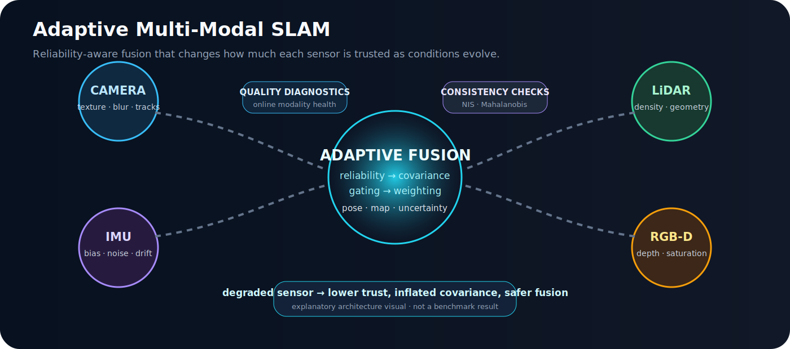

<div align="center">

# Adaptive Multi-Modal SLAM

## Προσαρμοστική Πολυτροπική SLAM με Fusion Αισθητήρων και Επίγνωση Αβεβαιότητας

**English:** [README.md](README.md) · **Ελληνικά**

</div>

<p align="center"></p>

<p align="center"><em>Επεξηγηματικό διάγραμμα της μεθόδου. Δεν αποτελεί benchmark σε πραγματικό dataset ή απόδειξη παραγωγικής ετοιμότητας.</em></p>

## Περίληψη

Το repository μελετά state estimation για ρομπότ που λειτουργούν με ετερογενείς και υποβαθμιζόμενους αισθητήρες. Η βασική ιδέα είναι ότι camera, IMU, LiDAR και RGB-D δεν πρέπει να συνεισφέρουν με σταθερό βάρος όταν η ποιότητά τους μεταβάλλεται. Το framework εκτιμά online reliability, προσαρμόζει covariance και fusion weights, εφαρμόζει innovation gating και καταγράφει uncertainty και failure diagnostics.

## Ερευνητικό ερώτημα

> Πώς μπορεί ένα σύστημα SLAM να προσαρμόζει online τη συμβολή camera, IMU, LiDAR και RGB-D όταν η αξιοπιστία κάθε modality μεταβάλλεται;

## Αρχιτεκτονική

```text
sensor packets
  → timestamp validation και synchronization
  → modality-specific quality diagnostics
  → online reliability estimate r_i(k)
  → covariance inflation και pseudo-precision weighting
  → Mahalanobis / NIS consistency checks
  → estimator update
  → pose, map, uncertainty και failure diagnostics
```

## Μαθηματική λογική

Για modality `i`, το reliability score `r_i(k)` καθορίζει:

```math
p_i(k)=\frac{\max(r_i(k),\epsilon)^\gamma}{\sigma_i^2},
\qquad
w_i(k)=\frac{p_i(k)}{\sum_j p_j(k)}
```

και την προσαρμοσμένη covariance:

```math
\tilde{\Sigma}_i(k)=\frac{\Sigma_i}{\max(r_i(k),\epsilon)^\gamma}.
```

Η συνέπεια innovation παρακολουθείται με:

```math
\mathrm{NIS}_i=\nu_i^T S_i^{-1}\nu_i.
```

Όταν υπάρχει ground truth, το NEES χρησιμοποιείται συμπληρωματικά για έλεγχο statistical consistency.

## Κύριες συνεισφορές

- reliability-aware modality weighting,
- δυναμική covariance inflation,
- Mahalanobis gating και NIS/NEES diagnostics,
- ATE, RPE, drift και tracking-recovery metrics,
- deterministic synthetic sensor degradations,
- scaffolds για EKF, factor graph, EuRoC και ORB-SLAM3 integration.

## Αναπαραγωγή

```bash
git clone https://github.com/panagiotagrosdouli/Adaptive-Multi-Modal-SLAM-with-Uncertainty-Aware-Sensor-Fusion.git
cd Adaptive-Multi-Modal-SLAM-with-Uncertainty-Aware-Sensor-Fusion
python -m venv .venv
source .venv/bin/activate
python -m pip install -e "[dev]"
python run_experiment.py --config configs/example_experiment.yaml
python scripts/run_all_phases.py
pytest
```

## Αξιολόγηση

| Διάσταση | Ενδεικτικές μετρικές |
|---|---|
| Trajectory accuracy | ATE, RPE, translational/rotational drift |
| Consistency | NIS, NEES, covariance trace, log-determinant |
| Reliability | calibration trend, false rejection, detection delay |
| Robustness | tracking failure, recovery time, degradation sensitivity |
| Computation | latency, frequency, CPU/GPU και memory όπου καταγράφονται |

## Περιορισμοί

- Δεν αποτελεί ολοκληρωμένο production camera–IMU–LiDAR–RGB-D SLAM stack.
- EKF και factor-graph backends παραμένουν research scaffolds.
- Real benchmark execution σε EuRoC, KITTI, TUM RGB-D και TUM-VI παραμένει pending.
- Reliability και risk scores δεν είναι αυτομάτως calibrated probabilities.
- Loop closure, relocalization και long-term map management είναι ελλιπή.
- Δεν διεκδικείται ROS 2, hardware, formal-safety ή state-of-the-art validation.

## Υπεύθυνη χρήση

Τα synthetic outputs επικυρώνουν συμπεριφορά λογισμικού και reproducibility, όχι πραγματική ρομποτική ανθεκτικότητα ή ασφάλεια πεδίου.
